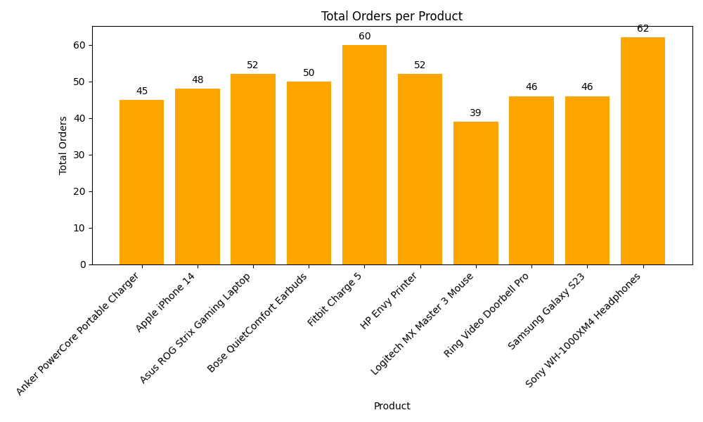

COMPANY: CODTECH IT SOLUTIONS

NAME: PEDDAPUDI NAVEENKUMAR

INTERN ID: CT08DH1065

DOMAIN: Data Analysis

DURATION: 4 WEEEKS

MENTOR: NEELA SANTOSH


# 📊 Big Data Analysis - Task 1

This project is part of an internship assignment focused on analyzing sales order data using **Apache PySpark** for distributed data processing and **Matplotlib** for visual representation.

## 📁 Project Structure

```
Big-Data-Analysis-Task1/
├── big_data_analysis_task1.py         # Main Python script
├── orders_data.csv                    # Input dataset (500 sample records)
├── product_summary_output.csv         # Aggregated summary output (auto-generated)
├── total_orders_per_product.png       # Bar chart visualization (auto-generated)
└── README.md                          # Project documentation
```

## 🚀 Features

- ⚙️ Processes CSV data using **PySpark**
- 🧮 Computes per-product statistics:
  - Total Orders
  - Average Quantity
  - Average Unit Price
  - Average Total Sale
- 📈 Visualizes total order count per product using **Matplotlib**
- 📦 Exports summary results to a CSV file

## 📌 Technologies Used

- [PySpark](https://spark.apache.org/docs/latest/api/python/)
- [Pandas](https://pandas.pydata.org/)
- [Matplotlib](https://matplotlib.org/)
- Python 3.8+

## 📥 How to Run

1. **Clone the repository:**

   ```bash
   git clone https://github.com/your-username/Big-Data-Analysis-Task1.git
   cd Big-Data-Analysis-Task1
   ```

2. **Install dependencies:**

   It's recommended to use a virtual environment.

   ```bash
   pip install pyspark pandas matplotlib
   ```

3. **Run the analysis script:**

   > ⚠️ Ensure the `orders_data.csv` file is available or update the file path inside the script.

   ```bash
   python big_data_analysis_task1.py
   ```

## 🖼️ Output Samples

### 📌 Console Output (Sample)

```
=== Sample Data ===
+--------+----------+----------------+----------------+--------+----------+-----------+
|OrderID | Date     | Customer       | Product        |Quantity|UnitPrice |TotalPrice |
+--------+----------+----------------+----------------+--------+----------+-----------+
|1001    |2024-01-01|Alice Johnson   |Samsung Galaxy  |3       |699.99    |2099.97    |
|...     |...       |...             |...             |...     |...       |...        |
```

### 📈 Visualization



## 📄 License

This project is licensed for academic/internship use. Feel free to reuse and adapt with proper credit.

## 🙋‍♂️ Author

**Peddapudi Naveenkumar**  
📧 [Email](mailto:peddapudinaveenkumar13@gmail.com)  
🔗 [LinkedIn](https://www.linkedin.com/in/naveen-kumar-peddapudi-413b36200/)
